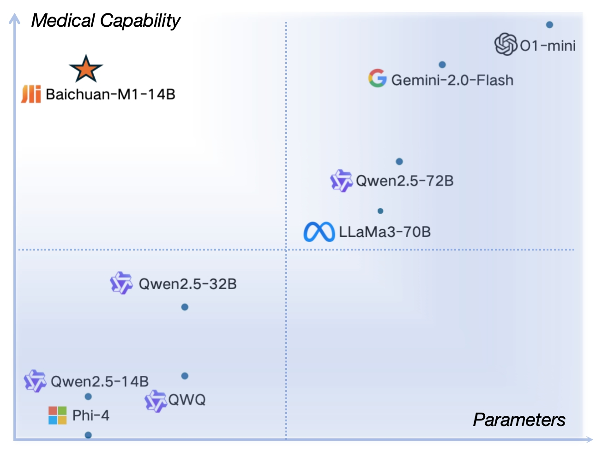
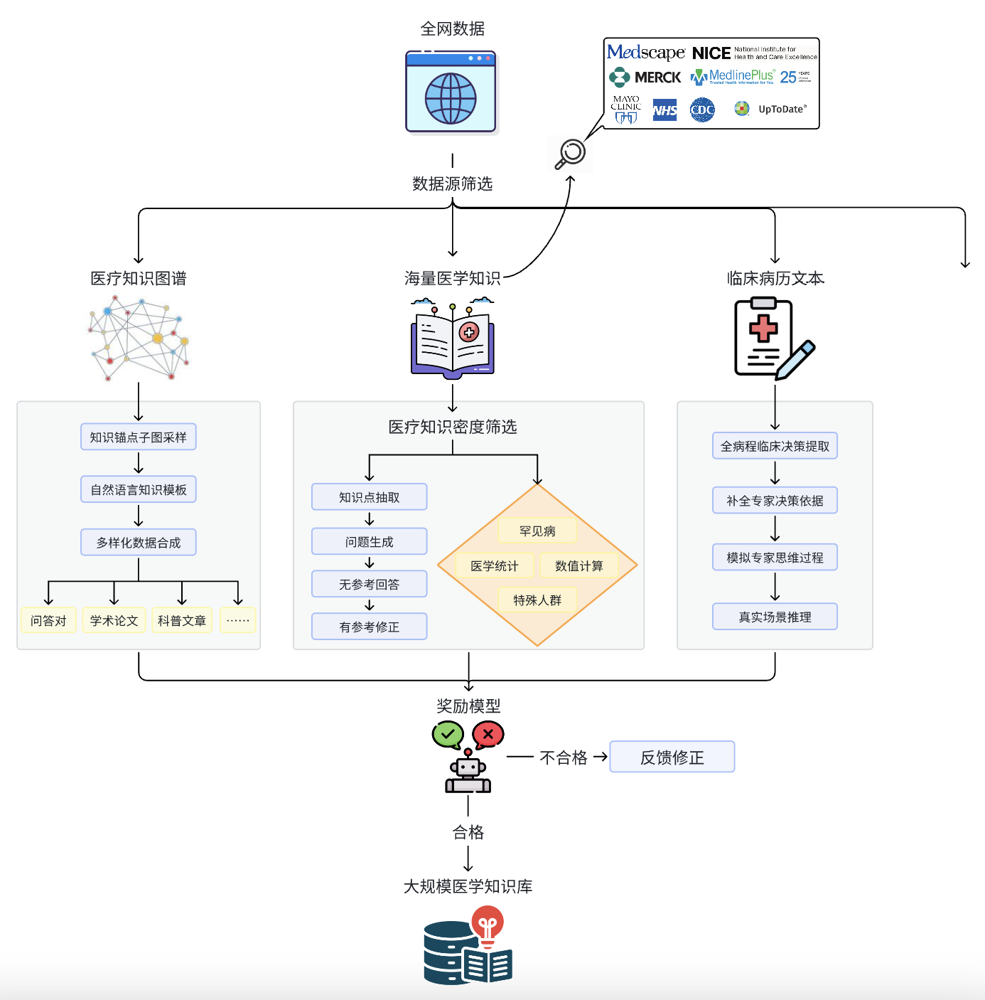
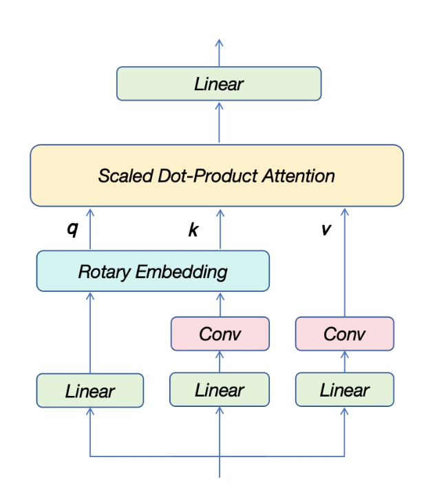
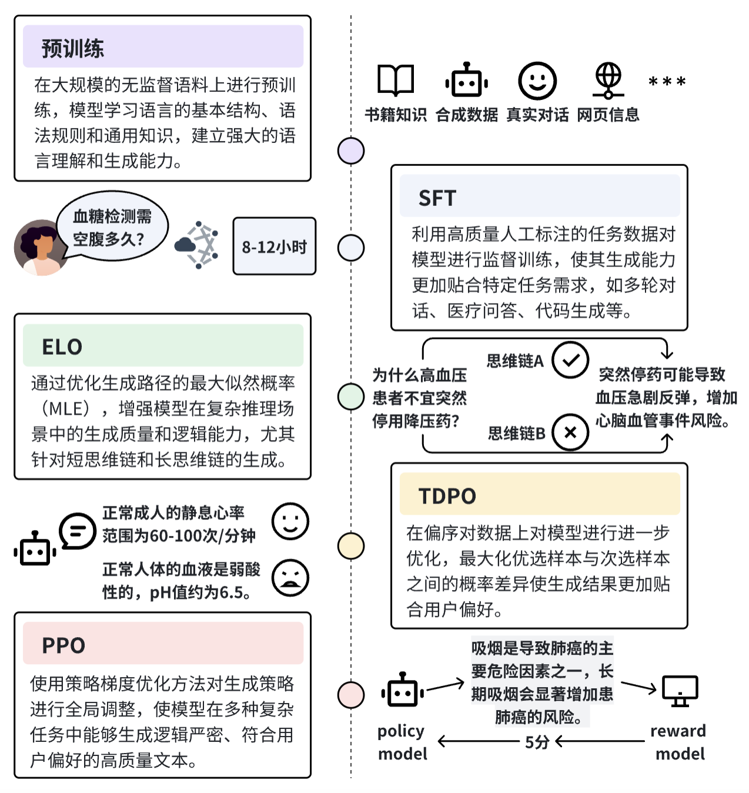

<div align="center">
<h1>
  Baichuan-M1-14B
</h1>
</div>

<p align="center">
🤗 <a href="https://huggingface.co/baichuan-inc/Baichuan-M1-14B-Base" target="_blank">Baichuan-M1-14B-Base</a> • 🤗 <a href="https://huggingface.co/baichuan-inc/Baichuan-M1-14B-Instruct" target="_blank">Baichuan-M1-14B-Instruct</a> • 💬 <a href="https://y41.8if.cn/JQCj6n" target="_blank">微信</a>
</p>

<h4 align="center">
    <p>
        <b>中文</b> |
        <a href="https://github.com/baichuan-inc/Baichuan-M1-14B/blob/main/README_EN.md">English</a>
    <p>
</h4>

</div>

---

# 📖 目录

- [🏁 模型介绍](#intro)
- [🔬 数据收集与处理](#data)
- [🧠 新模型结构](#structure)
- [⚙️ 训练方法](#training)
- [📊 Benchmark 结果](#benchmark)
- [🚀 快速开始](#quick)
- [📜 协议与声明](#declare)

---
<a name="intro"></a>
# 🏁 模型介绍

**Baichuan-14B-M1** 是由百川智能开发的业界首款从零开始专为医疗场景优化的开源大语言模型。在拥有卓越通用能力的同时，在医疗领域方面有着强大的性能。在大部分通用榜单评测中达到了同尺寸模型的效果，而在医疗场景中达到了5倍甚至更大的模型的效果。以下是模型的核心特点：

- 从零开始基于 **20万亿 token** 的高质量医疗与通用数据训练。
- 针对 **20+ 医疗科室** 细粒度医疗专业建模。
- 引入 **创新模型结构**，显著提升上下文理解和长序列任务表现。
- 提供 **[🤗 Base 模型](https://huggingface.co/baichuan-inc/Baichuan-M1-14B-Base)** 和 **[🤗 Instruct 模型](https://huggingface.co/baichuan-inc/Baichuan-M1-14B-Instruct)**。

<div align="center">
  
</div>

---
<a name="data"></a>
# 🔬 数据收集与处理

### 医疗数据收集

我们针对医疗领域进行了细致的数据收集与合成，包括：

- **千万级专业医疗数据**：中/英文专业论文、医疗病例、医疗教材、知识库等。
- **亿级医疗问答与临床数据**：涵盖复杂医疗推理与实际临床案例。
- **全面的数据分类与评估**：按医疗科室、内容和价值进行分类，确保数据分布均衡，筛选出真正具有医疗价值的数据。

### 数据合成与优化

- **合成数据设计**：利用包括教材、指南、知识库、论文等在内的海量医学知识文本，及结构化知识图谱和临床病历，生成多样化的高质量医疗推理数据。
- **自我反思机制与奖励模型**：不断提升合成数据质量，最终生成 **近万亿 token** 的医疗数据，覆盖长尾知识与复杂场景。
<div align="center">
  
</div>

### 通用数据收集

- **20T 多语言通用数据集**：包括 14T 英文数据、4T 中文数据、2T 涵盖 30 种主流语言的数据。
- **去重与上采样策略**：针对高质量数据进行适度上采样，显著提升模型性能。
- **27 类全球知识分类**：基于小模型实验优化数据配比，确保通用能力与领域能力的平衡。

---
<a name="structure"></a>
# 🧠 新模型结构

### 短卷积注意力机制

- 通过在**计算Key和Value时引入轻量化的短卷积操作**，显著降低了标准Transformer模型对induction heads机制学习的依赖。传统Transformer依赖induction heads来捕捉序列中的重复模式和上下文依赖，这需要一定的模型宽度和深度，而短卷积将Key序列和Value序列在时间序列上进行轻度解耦，提升了上下文学习能力。我们从toy model到十多B参数的模型上进行了广泛实验，结果表明，短卷积注意力机制语言建模任务中表现出色，尤其是对一些对上下文信息依赖性比较强的任务。
<div align="center">
  
</div>

### 滑动窗口注意力机制

- 在部分层中采用滑动窗口注意力机制，减少 KV Cache 内存占用。
- **优化点**：在计算效率和性能之间取得平衡，特别适用于长序列任务。

### 优化位置编码震荡

- 通过增大部分注意力头的维度，降低 RoPE 曲线震荡。
- **结果**：在长序列任务中表现更稳定，同时保持模型的多样化特征捕捉能力。

### 大峰值学习率策略

- 采用 **WSD 学习率调度策略**，使用高峰值学习率促进模型泛化能力。
- **对比结果**：显著提升 benchmark 上的任务表现。

### 自适应梯度更新

- **动态梯度剪裁**：当梯度过大时,当前机制能动态选择是否跳过更新，减少因特殊样本或陡峭损失空间导致的不稳定。

---
<a name="training"></a>
# ⚙️ 训练方法

我们创新性地采用了 **多阶段课程学习与对齐优化** 方法，以系统化的流程全面提升模型能力，具体包括以下两部分：

### 1. 多阶段课程学习

训练分为三个阶段，逐步优化模型的通用能力与医疗领域能力：

1. **通识能力提升阶段**：以通用语言建模为目标，提升基础语言能力和常识。
2. **医疗基础知识提升阶段**：引入高质量医疗数据，重点提升推理、数学及医学知识能力。
3. **医疗进阶知识提升阶段**：进一步优化数据质量，聚焦复杂医疗推理、病症判断和长尾知识。

### 2. 对齐优化

通过强化学习和偏序对数据的优化，提升模型生成质量、逻辑推理能力和用户偏好贴合度：

1. **偏序对数据**：覆盖多轮对话、指令跟随、数学与代码、推理任务等场景，数据来源包括人类标注和多模型生成。
2. **优化流程**：
   - **ELO**：基于最大似然优化多样化高质量的思维链生成。
   - **TDPO**：使用偏序对数据优化生成模型，使其更贴合用户偏好。
   - **PPO**：通过策略优化进一步增强生成逻辑与任务表现。
     
<div align="center">
  
</div>

这种多阶段与对齐优化相结合的方法，使模型在通用能力和医疗领域能力上均达到了卓越的水平。

---
<a name="benchmark"></a>
# 📊 Benchmark 结果

我们的评测覆盖了所有主流评测集，在开源与闭源评测中均取得了优异的指标，展现了卓越的医疗场景的能力，同时具备强大的通用表现。

<table style="border: 1px solid #000; border-collapse: collapse; width: 100%; text-align: center;">
    <thead>
        <tr>
            <th>分类</th>
            <th>Benchmark</th>
            <th style="font-size:15px;">Baichuan-M1-14B-Instruct</th>
            <th style="font-size:15px;">Qwen2.5-14B-Instruct</th>
            <th style="font-size:15px;">Qwen2.5-72B-Instruct</th>
            <th style="font-size:15px;">claude-3.5-sonnet-20241022</th>
            <th style="font-size:15px;">gpt-4o</th>
        </tr>
    </thead>
    <tbody>
        <tr>
            <td colspan="2" style="text-align: center;">平均分</td>
            <td>72.23</td>
            <td>65.39</td>
            <td>70.51</td>
            <td>74.85</td>
            <td>75.00</td>
        </tr>
        <tr>
            <td rowspan="7" style="vertical-align: middle;">临床实践</td>
            <td style="text-align: left;">cmbclin</td>
            <td>77.40</td>
            <td>71.51</td>
            <td>75.36</td>
            <td>78.37</td>
            <td>75.36</td>
        </tr>
        <tr>
            <td style="text-align: left;">clinicalbench_diag</td>
            <td>70.90</td>
            <td>68.85</td>
            <td>72.23</td>
            <td>75.00</td>
            <td>73.05</td>
        </tr>
        <tr>
            <td style="text-align: left;">clinicalbench_hos</td>
            <td>70.05</td>
            <td>68.83</td>
            <td>70.53</td>
            <td>65.58</td>
            <td>69.38</td>
        </tr>
        <tr>
            <td style="text-align: left;">clinicalbench_treat</td>
            <td>56.38</td>
            <td>55.03</td>
            <td>57.30</td>
            <td>64.03</td>
            <td>59.35</td>
        </tr>
        <tr>
            <td style="text-align: left;">rarearena_rdc</td>
            <td>81.80</td>
            <td>66.40</td>
            <td>76.20</td>
            <td>89.60</td>
            <td>88.40</td>
        </tr>
        <tr>
            <td style="text-align: left;">rarearena_rds</td>
            <td>54.00</td>
            <td>42.60</td>
            <td>49.80</td>
            <td>59.80</td>
            <td>57.20</td>
        </tr>
        <tr>
            <td style="text-align: left;">rarebench</td>
            <td>59.60</td>
            <td>52.80</td>
            <td>60.60</td>
            <td>65.30</td>
            <td>62.80</td>
        </tr>
        <tr>
            <td rowspan="10" style="vertical-align: middle;">考试</td>
            <td style="text-align: left;">cmexam</td>
            <td>80.10</td>
            <td>77.70</td>
            <td>82.70</td>
            <td>77.50</td>
            <td>78.00</td>
        </tr>
        <tr>
            <td style="text-align: left;">儿科职称考试</td>
            <td>78.48</td>
            <td>74.68</td>
            <td>84.81</td>
            <td>76.58</td>
            <td>78.48</td>
        </tr>
        <tr>
            <td style="text-align: left;">内科职称考试</td>
            <td>83.42</td>
            <td>86.10</td>
            <td>87.17</td>
            <td>87.70</td>
            <td>83.42</td>
        </tr>
        <tr>
            <td style="text-align: left;">全科职称考试</td>
            <td>87.07</td>
            <td>88.44</td>
            <td>88.44</td>
            <td>81.63</td>
            <td>84.35</td>
        </tr>
        <tr>
            <td style="text-align: left;">USMLE</td>
            <td>78.00</td>
            <td>67.20</td>
            <td>76.70</td>
            <td>85.90</td>
            <td>87.10</td>
        </tr>
        <tr>
            <td style="text-align: left;">medbullets</td>
            <td>66.88</td>
            <td>54.22</td>
            <td>64.29</td>
            <td>72.40</td>
            <td>75.97</td>
        </tr>
        <tr>
            <td style="text-align: left;">mediq</td>
            <td>83.40</td>
            <td>66.80</td>
            <td>79.90</td>
            <td>88.80</td>
            <td>90.20</td>
        </tr>
        <tr>
            <td style="text-align: left;">nejmqa</td>
            <td>49.75</td>
            <td>45.69</td>
            <td>50.76</td>
            <td>69.54</td>
            <td>54.31</td>
        </tr>
        <tr>
            <td style="text-align: left;">pubmedqa</td>
            <td>75.20</td>
            <td>76.40</td>
            <td>75.60</td>
            <td>77.00</td>
            <td>77.60</td>
        </tr>
        <tr>
            <td style="text-align: left;">redisqa</td>
            <td>74.50</td>
            <td>69.70</td>
            <td>75.00</td>
            <td>83.20</td>
            <td>82.80</td>
        </tr>
        <tr>
            <td rowspan="5" style="vertical-align: middle;">基础能力</td>
            <td style="text-align: left;">mednli_dis</td>
            <td>80.40</td>
            <td>68.90</td>
            <td>74.90</td>
            <td>58.30</td>
            <td>79.80</td>
        </tr>
        <tr>
            <td style="text-align: left;">medcalc</td>
            <td>56.00</td>
            <td>31.40</td>
            <td>37.90</td>
            <td>52.60</td>
            <td>49.00</td>
        </tr>
        <tr>
            <td style="text-align: left;">MMLU-anatomy</td>
            <td>80.00</td>
            <td>67.41</td>
            <td>71.11</td>
            <td>86.67</td>
            <td>91.11</td>
        </tr>
        <tr>
            <td style="text-align: left;">MMLU-virology</td>
            <td>54.82</td>
            <td>56.02</td>
            <td>53.01</td>
            <td>54.22</td>
            <td>57.23</td>
        </tr>
        <tr>
            <td style="text-align: left;">MMLU-genetics</td>
            <td>91.00</td>
            <td>82.00</td>
            <td>87.00</td>
            <td>97.00</td>
            <td>95.00</td>
        </tr>
    </tbody>
</table>


---
<a name="quick"></a>
# 🚀 快速开始

### 🤗 Hugging Face Transformers

我们建议使用最新版的 Transformers 库（至少 4.47.0）。以下代码片段展示了如何使用 **Baichuan-M1-14B-Instruct** 模型：

```python
from transformers import AutoModelForCausalLM, AutoTokenizer
import torch
# 1. Load pre-trained model and tokenizer
model_name = "baichuan-inc/Baichuan-M1-14B-Instruct"  
tokenizer = AutoTokenizer.from_pretrained(model_name,trust_remote_code=True)
model = AutoModelForCausalLM.from_pretrained(model_name,trust_remote_code=True,torch_dtype = torch.bfloat16).cuda()
# 2. Input prompt text
prompt = "May I ask you some questions about medical knowledge?"

# 3. Encode the input text for the model
messages = [
    {"role": "system", "content": "You are a helpful assistant."},
    {"role": "user", "content": prompt}
]
text = tokenizer.apply_chat_template(
    messages,
    tokenize=False,
    add_generation_prompt=True
)
model_inputs = tokenizer([text], return_tensors="pt").to(model.device)

# 4. Generate text
generated_ids = model.generate(
    **model_inputs,
    max_new_tokens=512
)
generated_ids = [
    output_ids[len(input_ids):] for input_ids, output_ids in zip(model_inputs.input_ids, generated_ids)
]

# 5. Decode the generated text
response = tokenizer.batch_decode(generated_ids, skip_special_tokens=True)[0]


# 6. Output the result
print("Generated text:")
print(response)
```

---
<a name="declare"></a>
# 📜 协议与声明
如果将 Baichuan-M1 模型或其衍生品用作商业用途，请您按照如下方式联系许可方：联系邮箱：opensource.contact@baichuan-inc.com，具体信息可见 [《Baichuan-M1-14B模型社区许可协议》](https://github.com/baichuan-inc/Baichuan-M1-14B/blob/main/Baichuan-M1-14B模型社区许可协议.pdf)。

所有使用者需遵循法律法规，不得将模型用于危害国家安全或违法用途。
