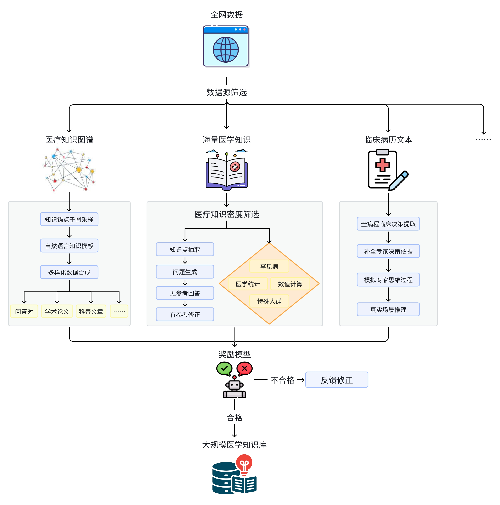
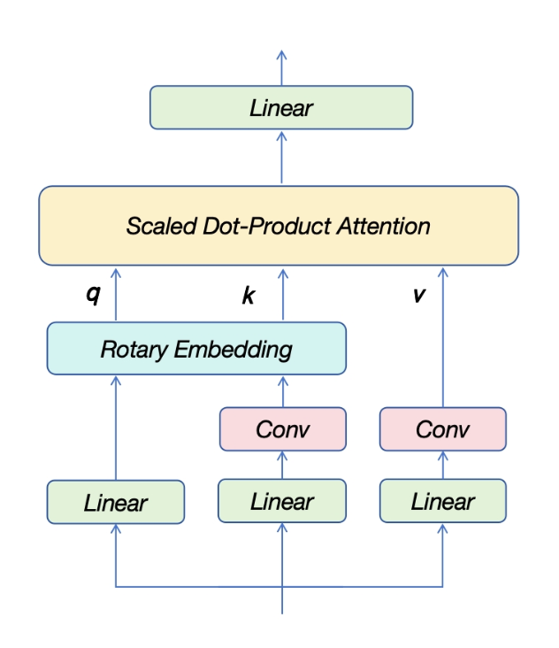

<div align="center">
<h1>
  Baichuan-M1-14B
</h1>
</div>

<p align="center">
🤗 <a href="https://huggingface.co/baichuan-inc/Baichuan-M1-14B-Base" target="_blank">Baichuan-M1-14B-Base</a> • 🤗 <a href="https://huggingface.co/baichuan-inc/Baichuan-M1-14B-Instruct" target="_blank">Baichuan-M1-14B-Instruct</a> • 💬 <a href="https://y41.8if.cn/JQCj6n" target="_blank">WeChat</a>
</p>

<h4 align="center">
    <p>
        <a href="https://github.com/baichuan-inc/Baichuan-M1-14B/blob/main/README.md">中文</a> |
        <b>English</b>
    <p>
</h4>

---

# 📖 Table of Contents

- [🏁 Model Introduction](#intro)
- [🔬 Data Collection and Processing](#data)
- [🧠 New Model Architecture](#structure)
- [⚙️ Training Methodology](#training)
- [📊 Benchmark Results](#benchmark)
- [🚀 Quick Start](#quick)
- [📜 Declaration](#declare)

---
<a name="intro"></a>
# 🏁 Model Introduction

**Baichuan-14B-M1** is the industry's first open-source large language model developed from scratch by Baichuan Intelligence, specifically optimized for medical scenarios. While excelling in general capabilities, it demonstrates powerful performance in the medical field. It achieves results comparable to models of similar size in most general benchmark evaluations, while outperforming models five times larger in medical scenarios. Below are the core features of the model:

- Trained from scratch on **20 trillion tokens** of high-quality medical and general data.
- Specialized modeling for **20+ medical departments** with fine-grained medical expertise.
- Introduces **innovative model architecture**, significantly improving context understanding and long-sequence task performance.
- Provides **[🤗 Base Model](https://huggingface.co/baichuan-inc/Baichuan-M1-14B-Base)** and **[🤗 Instruct Model](https://huggingface.co/baichuan-inc/Baichuan-M1-14B-Instruct)**.

<div align="center">
  
</div>

---
<a name="data"></a>
# 🔬 Data Collection and Processing

## Medical Data Collection

We conducted meticulous data collection and synthesis for the medical field, including:

- **Tens of millions of professional medical data**: Chinese/English professional papers, medical cases, medical textbooks, knowledge bases, etc.
- **Hundreds of millions of medical Q&A and clinical data**: Covering complex medical reasoning and real-world clinical cases.
- **Comprehensive data classification and evaluation**: Categorized by medical departments, content, and value to ensure balanced data distribution and filter out truly valuable medical data.

## Data Synthesis and Optimization

- **Synthetic data design**: Combining knowledge graphs, cases, and textbooks to generate diverse, high-quality medical reasoning data.
- **Self-reflection mechanism and reward model**: Continuously improving the quality of synthetic data, ultimately generating **nearly a trillion tokens** of medical data, covering long-tail knowledge and complex scenarios.
<div align="center">
  
</div>

## General Data Collection

- **20T multilingual general dataset**: Including 14T English data, 4T Chinese data, and 2T data covering 30 mainstream languages.
- **Deduplication and upsampling strategy**: Upsampling high-quality data to significantly enhance model performance.
- **27 global knowledge categories**: Optimizing data ratios based on small model experiments to balance general and domain-specific capabilities.

---
<a name="structure"></a>
# 🧠 New Model Architecture

## Short Convolution Attention Mechanism

- By introducing lightweight short convolution operations when computing Key and Value, the reliance of standard Transformer models on induction heads for learning is significantly reduced. Traditional Transformers rely on induction heads to capture repetitive patterns and contextual dependencies in sequences, which requires a certain model width and depth. Short convolution decouples the Key and Value sequences in the time dimension, enhancing context learning capabilities. Extensive experiments from toy models to models with over ten billion parameters show that the short convolution attention mechanism excels in language modeling tasks, especially those heavily dependent on contextual information.
<div align="center">
  
</div>

## Sliding Window Attention Mechanism

- Adopting a sliding window attention mechanism in some layers to reduce KV Cache memory usage.
- **Optimization**: Balancing computational efficiency and performance, especially suitable for long-sequence tasks.

## Optimizing Position Encoding Oscillation

- By increasing the dimensions of some attention heads, RoPE curve oscillation is reduced.
- **Result**: More stable performance in long-sequence tasks while maintaining the model's ability to capture diverse features.

## High Peak Learning Rate Strategy

- Using **WSD learning rate scheduling strategy** with high peak learning rates to promote model generalization.
- **Comparison results**: Significant improvement in benchmark task performance.

## Adaptive Gradient Update

- **Dynamic gradient clipping**: Skipping updates when gradients are too large to reduce instability caused by special samples or steep loss spaces.

---
<a name="training"></a>
# ⚙️ Training Methodology

We innovatively adopted a **multi-stage curriculum learning and alignment optimization** approach, systematically enhancing model capabilities through the following two parts:

## 1. Multi-Stage Curriculum Learning

Training is divided into three stages, progressively optimizing the model's general and medical domain capabilities:

1. **General Knowledge Enhancement Stage**: Focused on general language modeling to improve basic language and common sense.
2. **Medical Basic Knowledge Enhancement Stage**: Introducing high-quality medical data to enhance reasoning, mathematical, and medical knowledge.
3. **Medical Advanced Knowledge Enhancement Stage**: Further optimizing data quality, focusing on complex medical reasoning, disease diagnosis, and long-tail knowledge.

## 2. Alignment Optimization

Enhancing model generation quality, logical reasoning, and user preference alignment through reinforcement learning and pairwise data optimization:

1. **Pairwise Data**: Covering multi-turn dialogues, instruction following, math and code, and reasoning tasks, sourced from human annotations and multi-model generation.
2. **Optimization Process**:
   - **ELO**: Optimizing diverse, high-quality chain-of-thought generation based on maximum likelihood.
   - **TDPO**: Using pairwise data to optimize the generation model for better user preference alignment.
   - **PPO**: Further enhancing generation logic and task performance through policy optimization.
     
<div align="center">
  
</div>

This combined approach of multi-stage and alignment optimization enables the model to achieve exceptional performance in both general and medical domain capabilities.

---
<a name="benchmark"></a>
# 📊 Benchmark Results

Our evaluation covers all mainstream benchmarks, achieving excellent metrics in both open-source and closed-source evaluations, demonstrating outstanding medical scenario capabilities while maintaining strong general performance.

<table style="border: 1px solid #000; border-collapse: collapse; width: 100%; text-align: center;">
    <thead>
        <tr>
            <th>Category</th>
            <th>Benchmark</th>
            <th style="font-size:15px;">Baichuan-M1-14B-Instruct</th>
            <th style="font-size:15px;">Qwen2.5-14B-Instruct</th>
            <th style="font-size:15px;">Qwen2.5-72B-Instruct</th>
            <th style="font-size:15px;">claude-3.5-sonnet-20241022</th>
            <th style="font-size:15px;">gpt-4o-2024-05-13</th>
        </tr>
    </thead>
    <tbody>
        <tr>
            <td colspan="2" style="text-align: center;">Average Score</td>
            <td>72.23</td>
            <td>65.39</td>
            <td>70.51</td>
            <td>74.85</td>
            <td>75.00</td>
        </tr>
        <tr>
            <td rowspan="7" style="vertical-align: middle;">Clinical Practice</td>
            <td style="text-align: left;">cmbclin</td>
            <td>77.40</td>
            <td>71.51</td>
            <td>75.36</td>
            <td>78.37</td>
            <td>75.36</td>
        </tr>
        <tr>
            <td style="text-align: left;">clinicalbench_diag</td>
            <td>70.90</td>
            <td>68.85</td>
            <td>72.23</td>
            <td>75.00</td>
            <td>73.05</td>
        </tr>
        <tr>
            <td style="text-align: left;">clinicalbench_hos</td>
            <td>70.05</td>
            <td>68.83</td>
            <td>70.53</td>
            <td>65.58</td>
            <td>69.38</td>
        </tr>
        <tr>
            <td style="text-align: left;">clinicalbench_treat</td>
            <td>56.38</td>
            <td>55.03</td>
            <td>57.30</td>
            <td>64.03</td>
            <td>59.35</td>
        </tr>
        <tr>
            <td style="text-align: left;">rarearena_rdc</td>
            <td>81.80</td>
            <td>66.40</td>
            <td>76.20</td>
            <td>89.60</td>
            <td>88.40</td>
        </tr>
        <tr>
            <td style="text-align: left;">rarearena_rds</td>
            <td>54.00</td>
            <td>42.60</td>
            <td>49.80</td>
            <td>59.80</td>
            <td>57.20</td>
        </tr>
        <tr>
            <td style="text-align: left;">rarebench</td>
            <td>59.60</td>
            <td>52.80</td>
            <td>60.60</td>
            <td>65.30</td>
            <td>62.80</td>
        </tr>
        <tr>
            <td rowspan="10" style="vertical-align: middle;">Exams</td>
            <td style="text-align: left;">cmexam</td>
            <td>80.10</td>
            <td>77.70</td>
            <td>82.70</td>
            <td>77.50</td>
            <td>78.00</td>
        </tr>
        <tr>
            <td style="text-align: left;">Pediatric Qualification Exam</td>
            <td>78.48</td>
            <td>74.68</td>
            <td>84.81</td>
            <td>76.58</td>
            <td>78.48</td>
        </tr>
        <tr>
            <td style="text-align: left;">Internal Medicine Qualification Exam</td>
            <td>83.42</td>
            <td>86.10</td>
            <td>87.17</td>
            <td>87.70</td>
            <td>83.42</td>
        </tr>
        <tr>
            <td style="text-align: left;">General Practice Qualification Exam</td>
            <td>87.07</td>
            <td>88.44</td>
            <td>88.44</td>
            <td>81.63</td>
            <td>84.35</td>
        </tr>
        <tr>
            <td style="text-align: left;">USMLE</td>
            <td>78.00</td>
            <td>67.20</td>
            <td>76.70</td>
            <td>85.90</td>
            <td>87.10</td>
        </tr>
        <tr>
            <td style="text-align: left;">medbullets</td>
            <td>66.88</td>
            <td>54.22</td>
            <td>64.29</td>
            <td>72.40</td>
            <td>75.97</td>
        </tr>
        <tr>
            <td style="text-align: left;">mediq</td>
            <td>83.40</td>
            <td>66.80</td>
            <td>79.90</td>
            <td>88.80</td>
            <td>90.20</td>
        </tr>
        <tr>
            <td style="text-align: left;">nejmqa</td>
            <td>49.75</td>
            <td>45.69</td>
            <td>50.76</td>
            <td>69.54</td>
            <td>54.31</td>
        </tr>
        <tr>
            <td style="text-align: left;">pubmedqa</td>
            <td>75.20</td>
            <td>76.40</td>
            <td>75.60</td>
            <td>77.00</td>
            <td>77.60</td>
        </tr>
        <tr>
            <td style="text-align: left;">redisqa</td>
            <td>74.50</td>
            <td>69.70</td>
            <td>75.00</td>
            <td>83.20</td>
            <td>82.80</td>
        </tr>
        <tr>
            <td rowspan="5" style="vertical-align: middle;">Basic Capabilities</td>
            <td style="text-align: left;">mednli_dis</td>
            <td>80.40</td>
            <td>68.90</td>
            <td>74.90</td>
            <td>58.30</td>
            <td>79.80</td>
        </tr>
        <tr>
            <td style="text-align: left;">medcalc</td>
            <td>56.00</td>
            <td>31.40</td>
            <td>37.90</td>
            <td>52.60</td>
            <td>49.00</td>
        </tr>
        <tr>
            <td style="text-align: left;">MMLU-anatomy</td>
            <td>80.00</td>
            <td>67.41</td>
            <td>71.11</td>
            <td>86.67</td>
            <td>91.11</td>
        </tr>
        <tr>
            <td style="text-align: left;">MMLU-virology</td>
            <td>54.82</td>
            <td>56.02</td>
            <td>53.01</td>
            <td>54.22</td>
            <td>57.23</td>
        </tr>
        <tr>
            <td style="text-align: left;">MMLU-genetics</td>
            <td>91.00</td>
            <td>82.00</td>
            <td>87.00</td>
            <td>97.00</td>
            <td>95.00</td>
        </tr>
    </tbody>
</table>


---
<a name="quick"></a>
# 🚀 Quick Start

### 🤗 Hugging Face Transformers

We recommend using the latest version of the Transformers library (at least 4.47.0). The following code snippet demonstrates how to use the **Baichuan-M1-14B-Instruct** model:

```python
from transformers import AutoModelForCausalLM, AutoTokenizer
import torch
# 1. Load pre-trained model and tokenizer
model_name = "baichuan-inc/Baichuan-M1-14B-Instruct"  
tokenizer = AutoTokenizer.from_pretrained(model_name,trust_remote_code=True)
model = AutoModelForCausalLM.from_pretrained(model_name,trust_remote_code=True,torch_dtype = torch.bfloat16).cuda()
# 2. Input prompt text
prompt = "May I ask you some questions about medical knowledge?"

# 3. Encode the input text for the model
messages = [
    {"role": "system", "content": "You are a helpful assistant."},
    {"role": "user", "content": prompt}
]
text = tokenizer.apply_chat_template(
    messages,
    tokenize=False,
    add_generation_prompt=True
)
model_inputs = tokenizer([text], return_tensors="pt").to(model.device)

# 4. Generate text
generated_ids = model.generate(
    **model_inputs,
    max_new_tokens=512
)
generated_ids = [
    output_ids[len(input_ids):] for input_ids, output_ids in zip(model_inputs.input_ids, generated_ids)
]

# 5. Decode the generated text
response = tokenizer.batch_decode(generated_ids, skip_special_tokens=True)[0]


# 6. Output the result
print("Generated text:")
print(response)
```

---
<a name="declare"></a>
# 📜 Statement

The development team of Baichuan has not developed any commercial applications based on this model. All users must comply with laws and regulations and must not use the model for harmful national security or illegal purposes.
